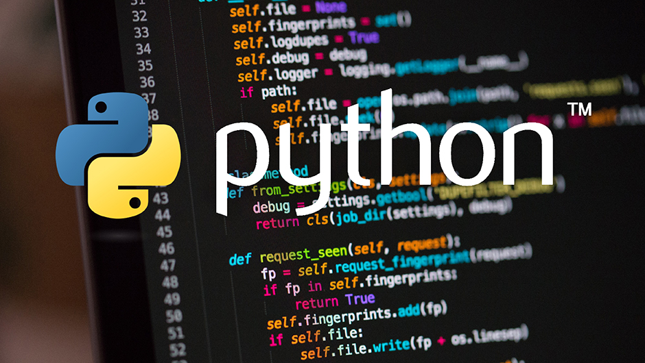

# Python: A Comprehensive Overview

## Introduction

Python is a high-level, versatile, and interpreted programming language known for its readability and ease of use. Guido van Rossum created Python in the late 1980s, and since then, it has evolved into one of the most popular languages in the world. Python's design philosophy emphasizes code readability and encourages developers to write clear and concise code. In this comprehensive overview, we will explore what Python is, how it works, its history, and its current applications.

## What is Python?

### High-Level and Interpreted

Python is a high-level programming language, which means it abstracts complex details from the machine and allows developers to focus on solving problems more efficiently. Additionally, Python is an interpreted language, meaning the code is executed line by line, making it easier to debug and test.

### General-Purpose

Python is a general-purpose language, meaning it is not limited to specific domains or applications. Whether you're building web applications, data analysis tools, artificial intelligence models, or scripting automation tasks, Python's flexibility makes it suitable for a wide range of applications.

### Object-Oriented

Python supports object-oriented programming (OOP) principles. OOP is a programming paradigm that uses objects, which encapsulate data and behaviors, to model real-world entities. This approach promotes modularity, code reuse, and maintainability.

## How Python Works

### Python Interpreter

Python code is executed by the Python interpreter, a software program that reads and interprets Python scripts. The interpreter converts high-level code into bytecode, a lower-level representation, which is then executed by the Python Virtual Machine (PVM). This process allows Python code to be platform-independent, running on various operating systems without modification.

### Dynamic Typing

Python is dynamically typed, meaning the data type of a variable is interpreted at runtime. Unlike statically typed languages where variable types are declared explicitly, Python allows variables to change types during execution. This flexibility simplifies coding but requires careful attention to avoid potential issues.

### Syntax and Indentation

Python's syntax is designed to be simple and readable. Instead of using braces or keywords, Python relies on indentation to define code blocks. This forces a consistent and clean coding style, reducing the chances of errors and making the code more accessible to developers.

## A Brief History of Python

### Origins and Guido van Rossum

Guido van Rossum, a Dutch programmer, created Python in the late 1980s. The language's name is inspired by Monty Python's Flying Circus, a British comedy troupe. Guido envisioned a language that prioritized code readability and embraced a minimalist philosophy.

### Python 2 and Python 3

Python 2, released in 2000, was a significant milestone for the language. However, as the development community expanded, it became evident that certain features needed improvement. In 2008, Python 3 was introduced to address these issues and enhance the language's consistency. Python 3 is not backward compatible with Python 2, leading to a gradual transition within the community.

### Community and Open Source

One key factor in Python's success is its strong and welcoming community. Python is an open-source language, and developers worldwide contribute to its growth. The Python Software Foundation (PSF) oversees the language's development, ensuring its evolution aligns with community values and needs.

## Applications of Python

### Web Development

Python is widely used in web development. Frameworks like Django and Flask simplify the creation of dynamic and scalable web applications. Python's simplicity and readability make it an excellent choice for both beginners and experienced developers in the web development domain.

### Data Science and Machine Learning

Python has become a dominant language in the field of data science and machine learning. Libraries such as NumPy, Pandas, and Scikit-learn facilitate data manipulation, analysis, and machine learning model development. The versatility of Python makes it a favorite among data scientists for exploration and experimentation.

### Automation and Scripting

Python's easy-to-read syntax and broad standard library make it a preferred language for automation and scripting tasks. From automating repetitive processes to creating system administration scripts, Python simplifies complex tasks and boosts productivity.

### Artificial Intelligence and Robotics

The popularity of Python extends to artificial intelligence and robotics. Libraries like TensorFlow and PyTorch enable developers to build sophisticated machine learning models. Python's adaptability makes it a language of choice in robotics for controlling and programming robotic systems.

### Game Development

While not as prevalent as in other domains, Python is gaining traction in game development. Libraries like Pygame provide a framework for building 2D games, and Godot Engine supports Python scripting for 3D game development. Python's simplicity appeals to game developers looking for quick prototyping and development.

## Summary

Python stands as a powerful, versatile, and community-driven programming language. Its design principles focus on simplicity, readability, and flexibility, making it an ideal choice for both beginners and experienced developers. Whether in web development, data science, automation, artificial intelligence, or game development, Python's widespread adoption and continuous growth affirm its significance in the ever-evolving landscape of programming languages.