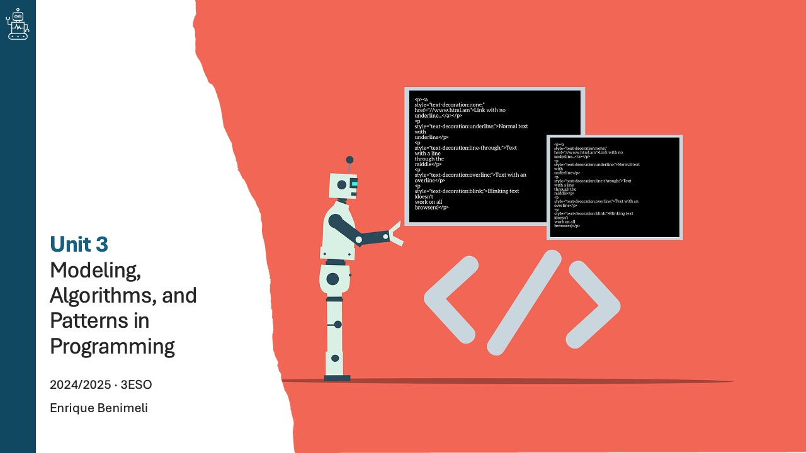
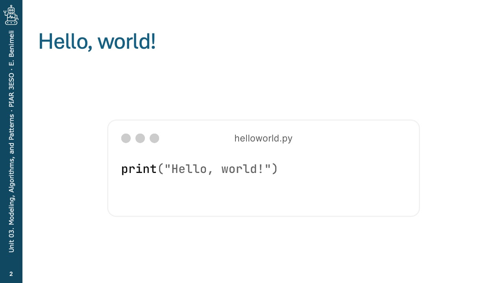
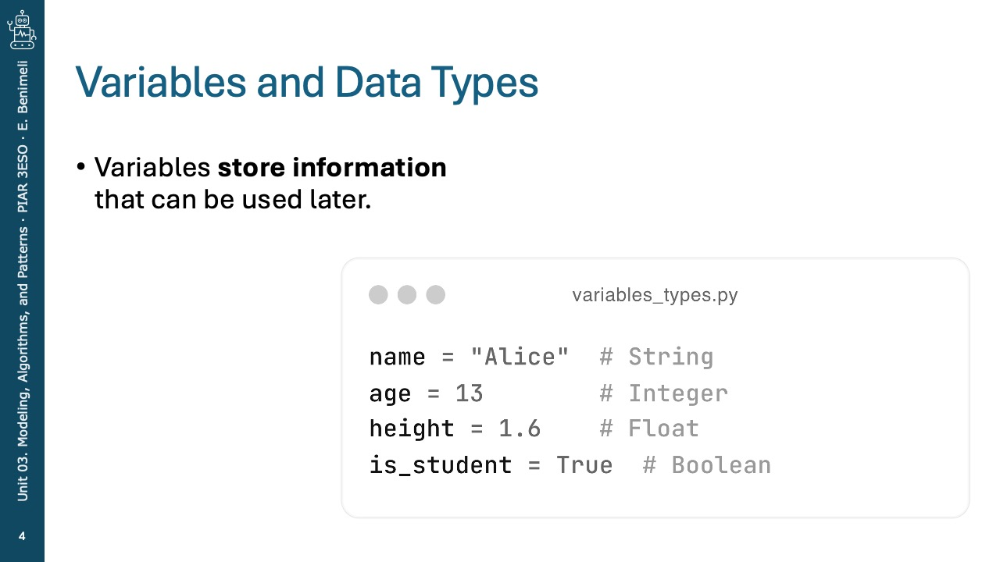
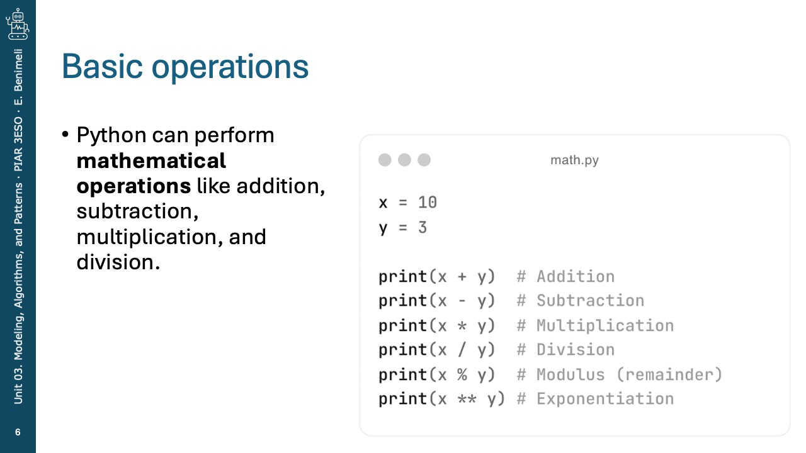
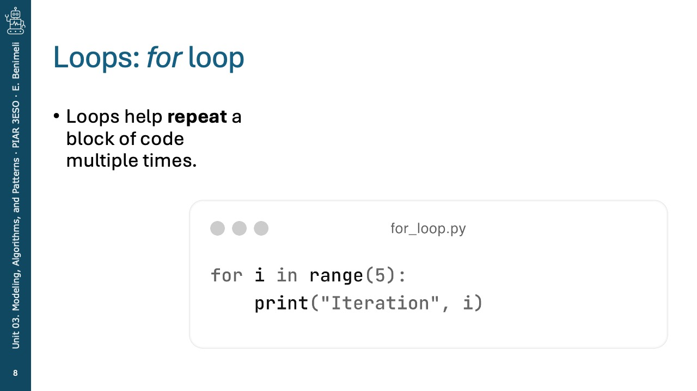
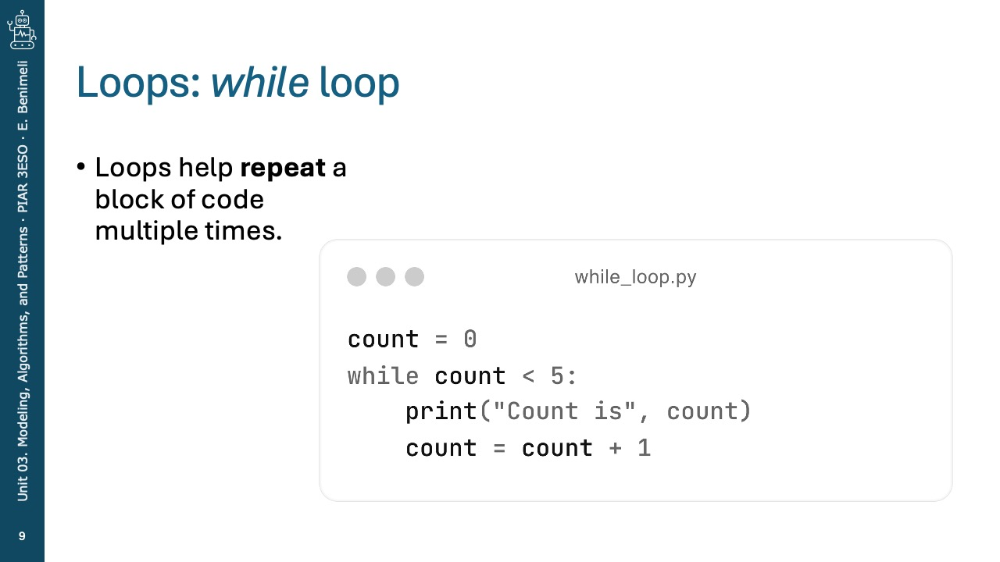
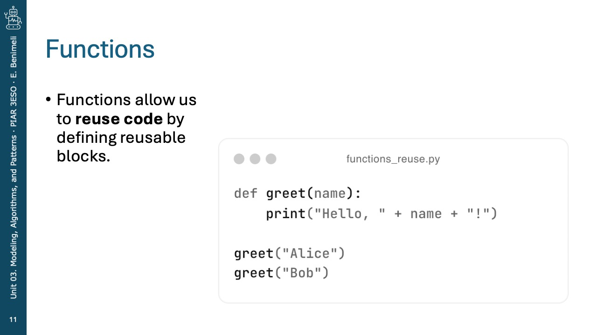
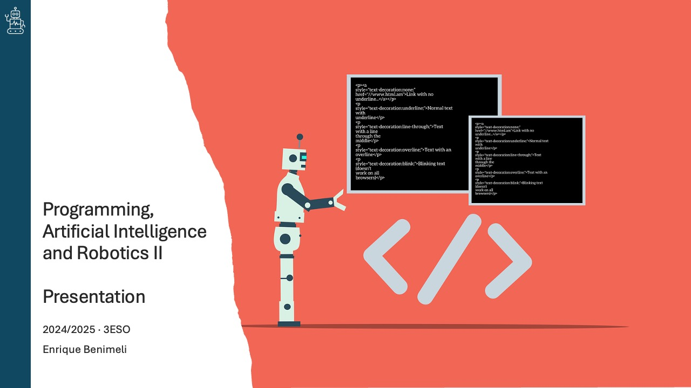

# Introduction to Python

Python is a beginner-friendly programming language that is easy to read and write. It is widely used in web development, data science, automation, and artificial intelligence.

<div class="glightbox">
  <a href="slides/python/Diapositiva1.jpeg" class="glightbox">
    
  </a>
  <a href="slides/python/Diapositiva2.jpeg" class="glightbox hidden">
    
  </a>
  <a href="slides/python/Diapositiva3.jpeg" class="glightbox hidden">
    
  </a>
  <a href="slides/python/Diapositiva4.jpeg" class="glightbox hidden">
    
  </a>
  <a href="slides/python/Diapositiva5.jpeg" class="glightbox hidden">
    
  </a>
  <a href="slides/python/Diapositiva6.jpeg" class="glightbox hidden">
    
  </a>
  <a href="slides/python/Diapositiva7.jpeg" class="glightbox hidden">
    
  </a>
  <a href="slides/python/Diapositiva8.jpeg" class="glightbox hidden">
    
  </a>
  <a href="slides/python/Diapositiva9.jpeg" class="glightbox hidden">
    
  </a>
  <a href="slides/python/Diapositiva10.jpeg" class="glightbox hidden">
    
  </a>
  <a href="slides/python/Diapositiva11.jpeg" class="glightbox hidden">
    
  </a>
  <a href="slides/python/Diapositiva12.jpeg" class="glightbox hidden">
    
  </a>
  <a href="slides/python/Diapositiva13.jpeg" class="glightbox hidden">
    
  </a>
  <a href="slides/python/Diapositiva14.jpeg" class="glightbox hidden">
    
  </a>
  <a href="slides/python/Diapositiva15.jpeg" class="glightbox hidden">
    
  </a>
  <a href="slides/python/Diapositiva16.jpeg" class="glightbox hidden">
    
  </a>
  <a href="slides/python/Diapositiva18.jpeg" class="glightbox hidden">
    
  </a>
</div>

<br/>

## 1. Printing Messages
The `print()` function is used to display messages on the screen.

```python
print("Hello, world!")
```

## 2. Variables and Data Types
Variables store information that can be used later.

```python
name = "Alice"  # String
age = 13        # Integer
height = 1.6    # Float
is_student = True  # Boolean
```

## 3. User Input
The `input()` function allows users to enter information.

```python
name = input("What is your name? ")
print("Hello, " + name + "!")
```

## 4. Basic Operations
Python can perform mathematical operations like addition, subtraction, multiplication, and division.

```python
x = 10
y = 3

print(x + y)  # Addition
print(x - y)  # Subtraction
print(x * y)  # Multiplication
print(x / y)  # Division
print(x % y)  # Modulus (remainder)
```

## 5. Conditional Statements
The `if` statement allows you to make decisions in your code.

```python
age = 13
if age >= 18:
    print("You are an adult.")
else:
    print("You are a minor.")
```

## 6. Loops
Loops help repeat a block of code multiple times.

### a) `for` loop
```python
for i in range(5):
    print("Iteration", i)
```

### b) `while` loop
```python
count = 0
while count < 5:
    print("Count is", count)
    count += 1
```

## 7. Functions
Functions allow us to reuse code by defining reusable blocks.

```python
def greet(name):
    print("Hello, " + name + "!")

greet("Alice")
greet("Bob")
```

These are the basic concepts of Python. As you progress, you will learn about more advanced topics like lists, dictionaries, and object-oriented programming!

