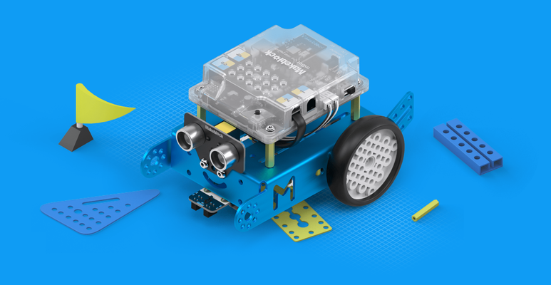

## mBot

# Ultrasonic Sensor

Me Ultrasonic module is an electronic module designed for distance detection. The distance range it can detect is 3-400 cm. mBot can use this module to avoid obstacles or for other programs about distance detection. The yellow tag on the interface of this module indicates that it is a single digital interface and that it should be connected to a port with the yellow tag on the main control board.

The ultrasonic sensor measures distance. One of the “eyes” transmits a sound, and the other waits for the echo of the sound to return. From the time this process takes, the distance of the object from the sensor can be calculated.

The ultrasonic sensor has a range of 3-400cm. If an object is outside this range, the sensor will return a value of 400.

## Line Follower Sensors

Me Line Follower is designed for line-following robots. There are two sensors, each with an IR transmitting LED and an IR static induction phototransistor. mBot can move along a black line on a white background or a white line on a black background. It features fast detection and simple circuits. The blue tag on the interface of this module indicates that it is a dual digital interface and that it should be connected to a port with the blue tag on the main control board.

The line follower has 2 sensors which can detect a white surface (within the range of 1-2cm).

It works by emitting IR (InfraRed) light and recording how much is reflected back:

- If a lot is reflected back, it can be deduced it is close to a white surface.
- If a little is reflected back, it can be deduced that the surface is black, or the sensor is not near a surface.

A light surface reflects a lot of infrared light back to the receiver. A dark surface only reflects a little light back to the receiver.

## TT Geared Motor

TT Geared Motor DC 6 V / 200 RPM is the new power source with plastic gears. The TT Geared Motor perfectly works with Makeblock Plastic Timing Pulley 62T and Plastic Timing Pulley 90T for the wheel systems of DIY projects. It can be used to power mBot.

