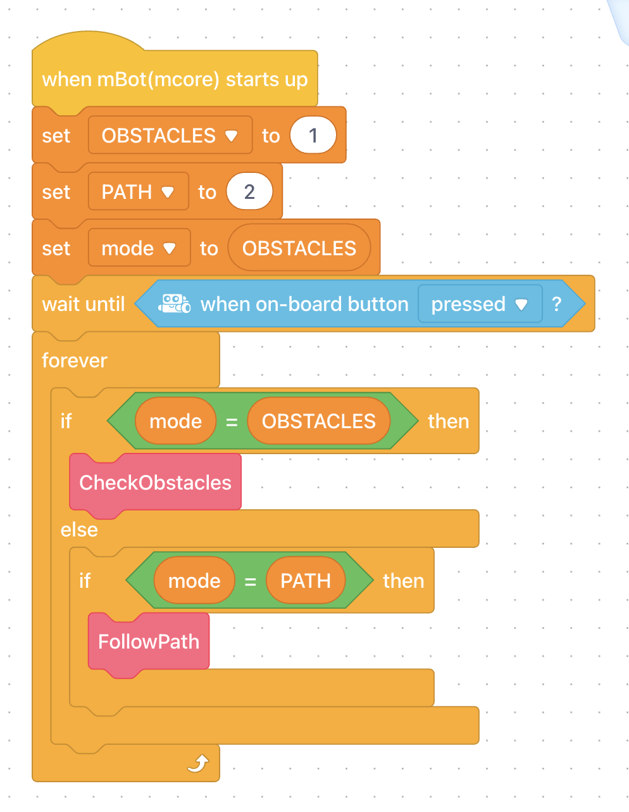
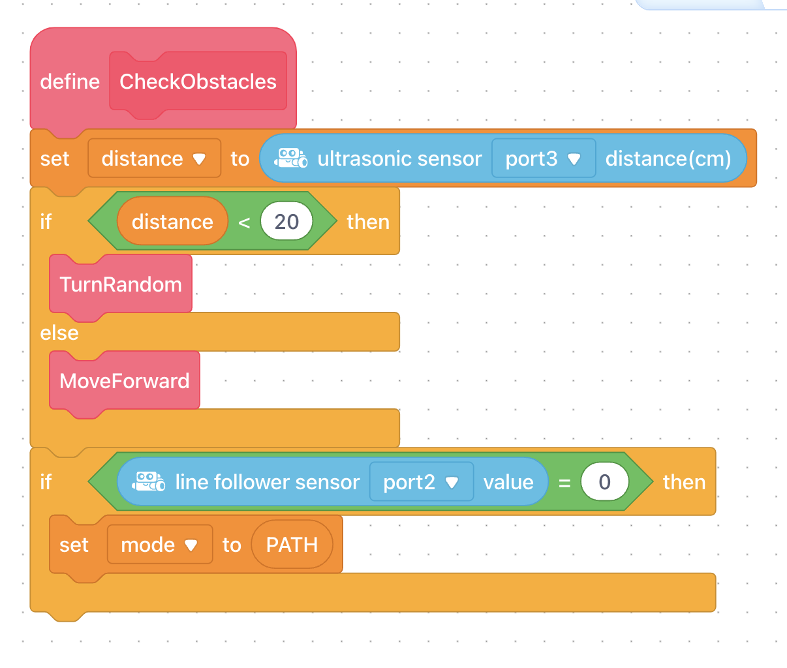
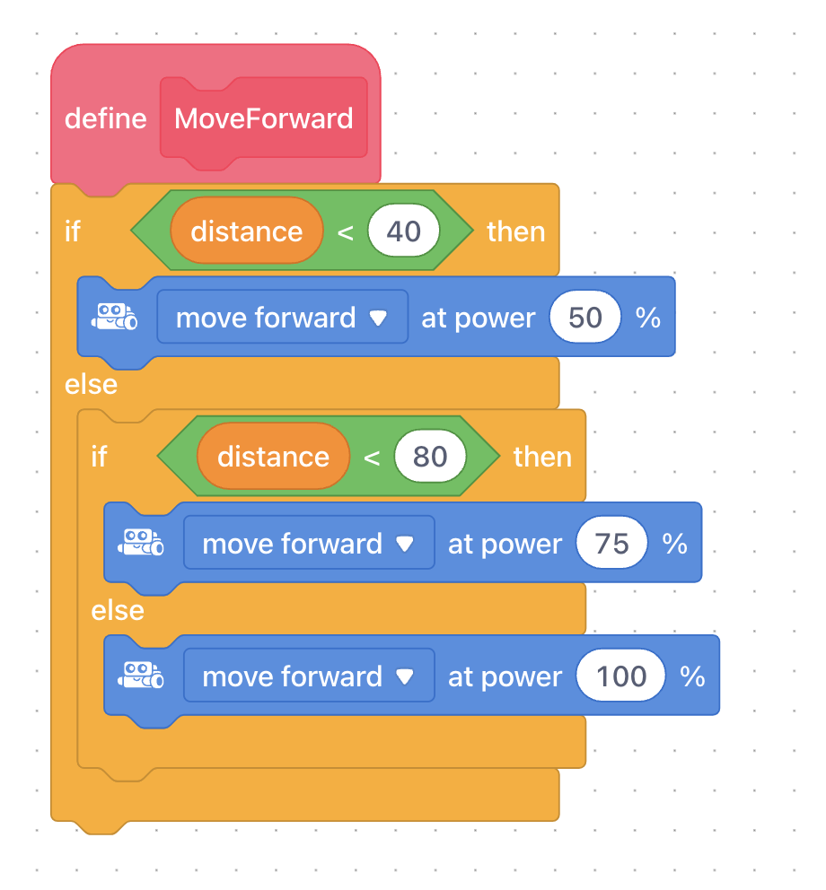
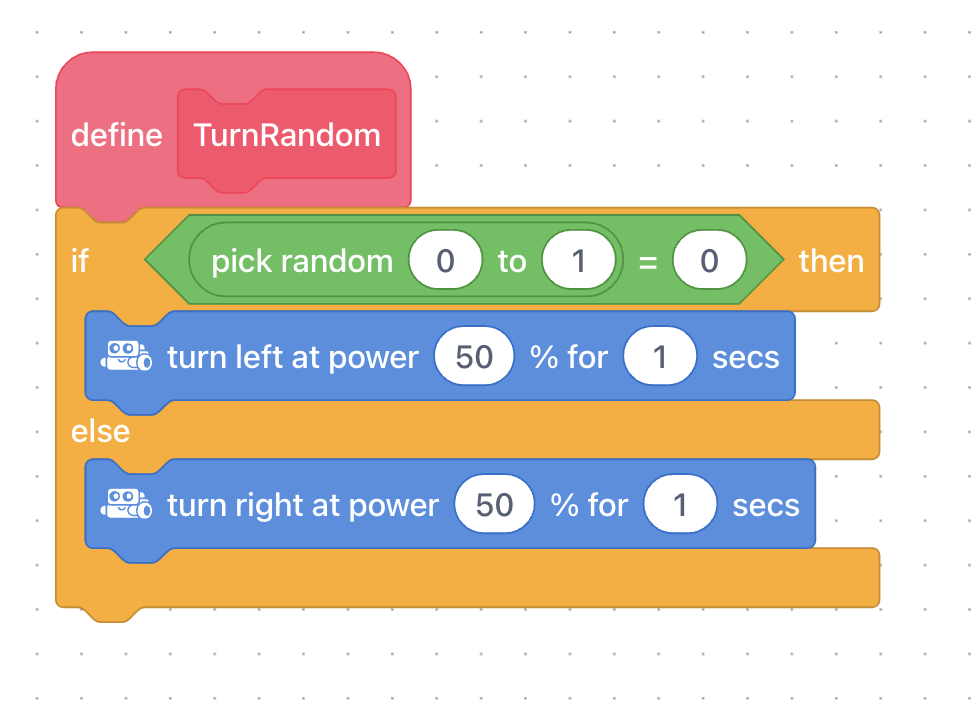
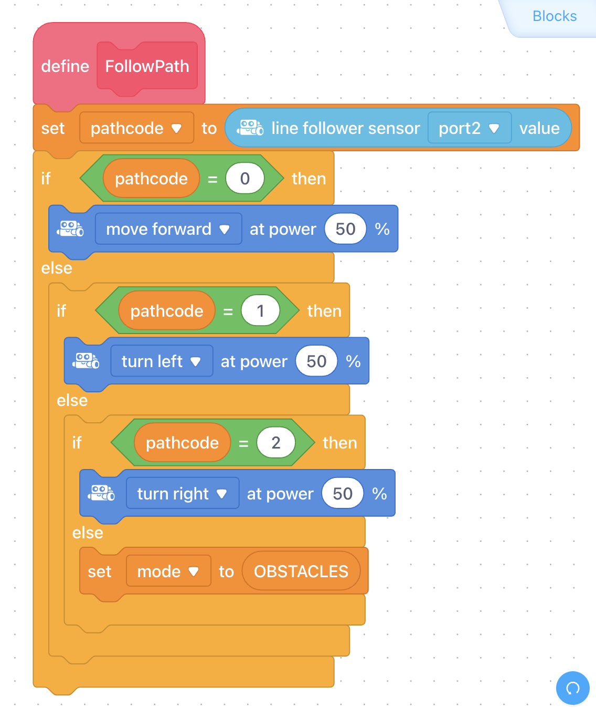

# mBot Robot Programming

## Main code

# The Ultrasonic Sensor

Me Ultrasonic module is an electronic module designed for distance detection. The distance range it can detect is 3-400 cm. mBot can use this module to avoid obstacles or for other programs about distance detection. The yellow tag on the interface of this module indicates that it is a single digital interface and that it should be connected to a port with the yellow tag on the main control board.

The ultrasonic sensor measures distance. One of the “eyes” transmits a sound, and the other waits for the echo of the sound to return. From the time this process takes, the distance of the object from the sensor can be calculated.

The ultrasonic sensor has a range of 3-400cm. If an object is outside this range, the sensor will return a value of 400.

## *CheckObstacles* block

This block is used to check for obstacles in front of the mBot. It allows the program to detect if there is an obstacle in the path of the robot using its sensors, such as the ultrasonic sensor.

## *MoveForward* block

This block commands the mBot to move forward in a straight line.

## *TurnRandom* block

This block instructs the mBot to turn in a random direction. It can be used to introduce randomness in the robot's movement or to create unpredictable behaviors.

# The Line Follower

The line follower has 2 sensors which can detect a white surface (within the range of 1-2cm).

It works by emitting IR (InfraRed) light and recording how much is reflected back:

- If a lot is reflected back, it can be deduced it is close to a white surface.
- If a little is reflected back, it can be deduced that the surface is black, or the sensor is not near a surface.

# *FollowPath* block

This block instructs the mBot to follow a line using its line-following sensors. The block typically includes parameters or inputs to specify the speed or power at which the robot should move and the behavior it should exhibit when encountering different line configurations.

The line-following sensors on the mBot detect the contrast between a line and the surrounding surface. The robot uses this information to determine its position relative to the line and adjust its movement accordingly. The *mBot_FollowPath* block allows users to define the specific actions the robot should take to stay on the line, such as turning left or right, stopping, or adjusting its speed.

