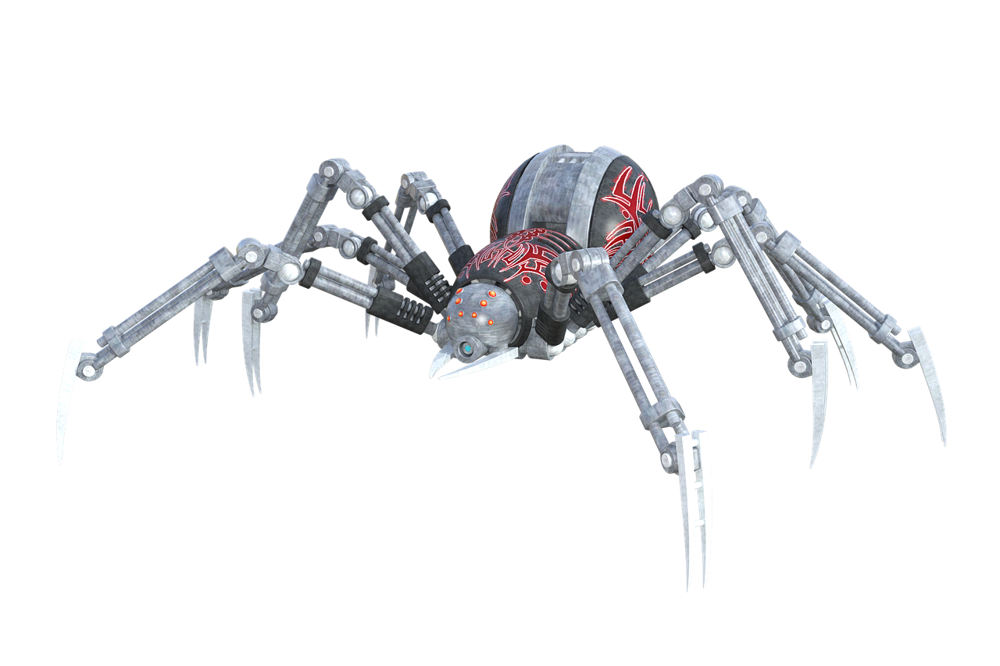

# Project: Researching an Advanced and Innovative Robot

In this activity, you will work in pairs to research a specific advanced and innovative robot. You will gather information about the robot and create a presentation to share with the class.

## Part 1: Choosing a robot

Start by discussing advanced and innovative robots with your partner. Choose a specific robot to research. Try to choose a robot that you find interesting or that relates to your personal interests.

## Part 2: Researching the robot

Use reliable sources such as academic journals, reputable websites, and news articles to gather information about the robot you have chosen.

Gather information on the following aspects of the robot:

- **Purpose**: What is the robot designed to do?
- **Design**: What does the robot look like? What components make up the robot?
- **Sensors**: What sensors does the robot use to interact with its environment?
- **Actuators**: What actuators does the robot use to move and interact with its environment?
- **Controller**: What type of controller does the robot use to manage its behavior?
- **Innovations**: What makes this robot advanced and innovative? What sets it apart from other robots?
- **Applications**: What are some of the potential applications for this robot? How might it be used in industry or everyday life?

## Part 3: Creating a presentation

Use PowerPoint to create a presentation to share your research with the class.

Your presentation should include the following:

- **Introduction**: Introduce the robot and explain why you chose it.
- Purpose: Describe what the robot is designed to do.
- Design: Share images and descriptions of the robot's design and components.
- Sensors: Explain what sensors the robot uses and how they work.
- Actuators: Explain what actuators the robot uses and how they work.
- Controller: Describe the type of controller the robot uses and how it manages the robot's behavior.
- Innovations: Discuss what makes this robot advanced and innovative.
- Applications: Share some potential applications for the robot.
- Conclusion: Summarize the key points and why this robot is interesting or important.

## Part 4: Presenting to the class

Present your research to the class, using your presentation. Be prepared to answer questions from your classmates about your robot.

This activity will allow you to explore and learn about advanced and innovative robots, while also developing your research and presentation skills. Have fun!