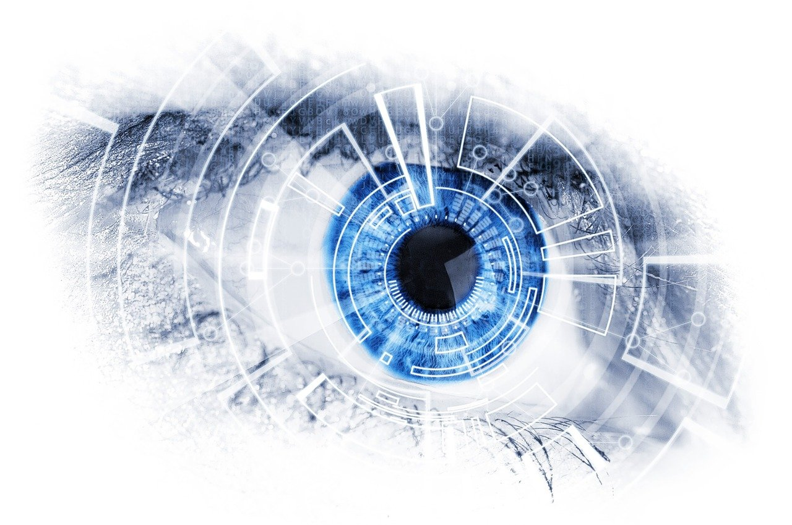

# Sensors

## Definition of sensor

**Sensors** are devices that can **detect and measure** physical and environmental conditions such as temperature, light, sound, and movement. In this lesson, we will learn about the different types of sensors used in AI applications and the different ways in which they can be used.

## Types of sensors

- **Optical sensors**: These sensors detect light and are used in applications such as facial recognition, object detection, and image processing. Examples of optical sensors include cameras and lidar sensors.

- **Temperature sensors**: These sensors measure temperature and are used in applications such as climate control and food safety. Examples of temperature sensors include thermocouples and thermistors.

- **Pressure sensors**: These sensors measure pressure and are used in applications such as industrial automation, weather forecasting, and healthcare. Examples of pressure sensors include piezoelectric sensors and strain gauge sensors.

- **Accelerometer sensors**: These sensors measure acceleration and are used in applications such as motion detection, navigation, and gaming. Examples of accelerometer sensors include MEMS accelerometers and piezoelectric accelerometers.

- **Gyroscopic sensors**: These sensors measure angular velocity and are used in applications such as navigation, gaming, and robotics. Examples of gyroscopic sensors include MEMS gyroscopes and fiber optic gyroscopes.

- **Magnetic sensors**: These sensors measure magnetic fields and are used in applications such as navigation, industrial automation, and healthcare. Examples of magnetic sensors include Hall effect sensors and magnetoresistive sensors.

- **Ultrasonic sensors**: These sensors measure distance and are used in applications such as object detection, navigation, and industrial automation. Examples of ultrasonic sensors include sonar sensors and lidar sensors.

- **Infrared sensors**: These sensors detect infrared radiation and are used in applications such as temperature measurement, night vision, and gesture recognition. Examples of infrared sensors include thermopile sensors and pyroelectric sensors.

- **Proximity sensors**: These sensors detect the presence of objects and are used in applications such as gesture recognition, object detection, and access control. Examples of proximity sensors include infrared proximity sensors and ultrasonic proximity sensors.

- **Light sensors**: These sensors detect light and are used in applications such as light control, gesture recognition, and object detection. Examples of light sensors include photodiodes and phototransistors.

- **Humidity sensors**: These sensors measure humidity and are used in applications such as weather forecasting, agriculture, and healthcare. Examples of humidity sensors include capacitive humidity sensors and resistive humidity sensors.

- **Gas sensors**: These sensors detect the presence of gases and are used in applications such as environmental monitoring, industrial automation, and healthcare. Examples of gas sensors include electrochemical gas sensors and metal oxide gas sensors.

## Quiz

**1. What do sensors detect and measure?**

a) Physical and environmental conditions 
b) Human emotions 
c) Food flavors 
d) Political opinions 

**2. Which type of sensor is used in facial recognition and image processing?**

a) Temperature sensors 
b) Pressure sensors 
c) Optical sensors 
d) Magnetic sensors 

**3. Which type of sensor measures acceleration?**

a) Temperature sensors 
b) Gyroscopic sensors 
c) Humidity sensors 
d) Gas sensors 

**4. What do proximity sensors detect?**

a) The presence of objects 
b) The color of objects 
c) The weight of objects 
d) The shape of objects 

**5. What type of sensors measure angular velocity and can be used in navigation and robotics?**

a) Gyroscopic sensors 
b) Temperature sensors 
c) Infrared sensors 
d) Gas sensors 

## Glossary

| English                  | Spanish                   | Example Sentence (English)                                                                         |
|--------------------------|---------------------------|----------------------------------------------------------------------------------------------------|
| **Accelerometer sensors**| Sensores de aceleración   | "The **accelerometer sensors** detected sudden movements and adjusted the robot's trajectory."       |
| **Color sensors**        | Sensores de color         | "The robot's **color sensors** enabled it to distinguish between different objects based on hue."     |
| **Force sensors**        | Sensores de fuerza        | "The robot used **force sensors** to measure the applied force during object manipulation."          |
| **Gas sensors**          | Sensores de gas           | "The robot's safety was enhanced by **gas sensors** that detected hazardous fumes."                  |
| **Gyroscopic sensors**   | Sensores giroscópicos     | "The robot's precise movements were achieved with the help of **gyroscopic sensors**."               |
| **Humidity sensors**     | Sensores de humedad       | "The **humidity sensors** ensured optimal conditions for plant growth in automated farming."         |
| **Infrared sensors**     | Sensores infrarrojos      | "The **infrared sensors** detected human body heat for gesture recognition."                         |
| **Light sensors**        | Sensores de luz           | "The robot adjusted its behavior based on the readings from the **light sensors**."                  |
| **Magnetic sensors**     | Sensores magnéticos       | "The robot relied on **magnetic sensors** to navigate and avoid obstacles in its path."              |
| **Motion sensors**       | Sensores de movimiento    | "The robot's behavior was influenced by the readings from the **motion sensors** in its environment."|
| **Pressure sensors**     | Sensores de presión       | "The robot used **pressure sensors** to monitor the gripping force during assembly tasks."           |
| **Proximity sensors**    | Sensores de proximidad    | "The robot's precise movements were achieved with the help of **proximity sensors**."               |
| **Sound sensors**        | Sensores de sonido        | "The robot utilized **sound sensors** to identify specific audio patterns in its environment."       |
| **Temperature sensors**  | Sensores de temperatura   | "The robot's **temperature sensors** ensured optimal conditions for storing perishable goods."        |
| **Touch sensors**        | Sensores táctiles         | "The robot's **touch sensors** allowed it to detect and respond to human touch."                     |
| **Ultrasonic sensors**   | Sensores ultrasónicos     | "The robot used **ultrasonic sensors** to detect the presence of objects in its vicinity."           |
| **Vibration sensors**    | Sensores de vibración     | "The robot's navigation system incorporated **vibration sensors** for terrain analysis."             |
| **GPS sensors**          | Sensores GPS              | "The robot relied on **GPS sensors** to navigate outdoor environments with precise location tracking."|
| **Humidity sensors**     | Sensores de humedad       | "The **humidity sensors** ensured optimal conditions for weather forecasting and agriculture."       |
| **Infrared sensors**     | Sensores infrarrojos      | "The **infrared sensors** detected human body heat for gesture recognition."                         |
| **Light sensors**        | Sensores de luz           | "The robot adjusted its behavior based on the readings from the **light