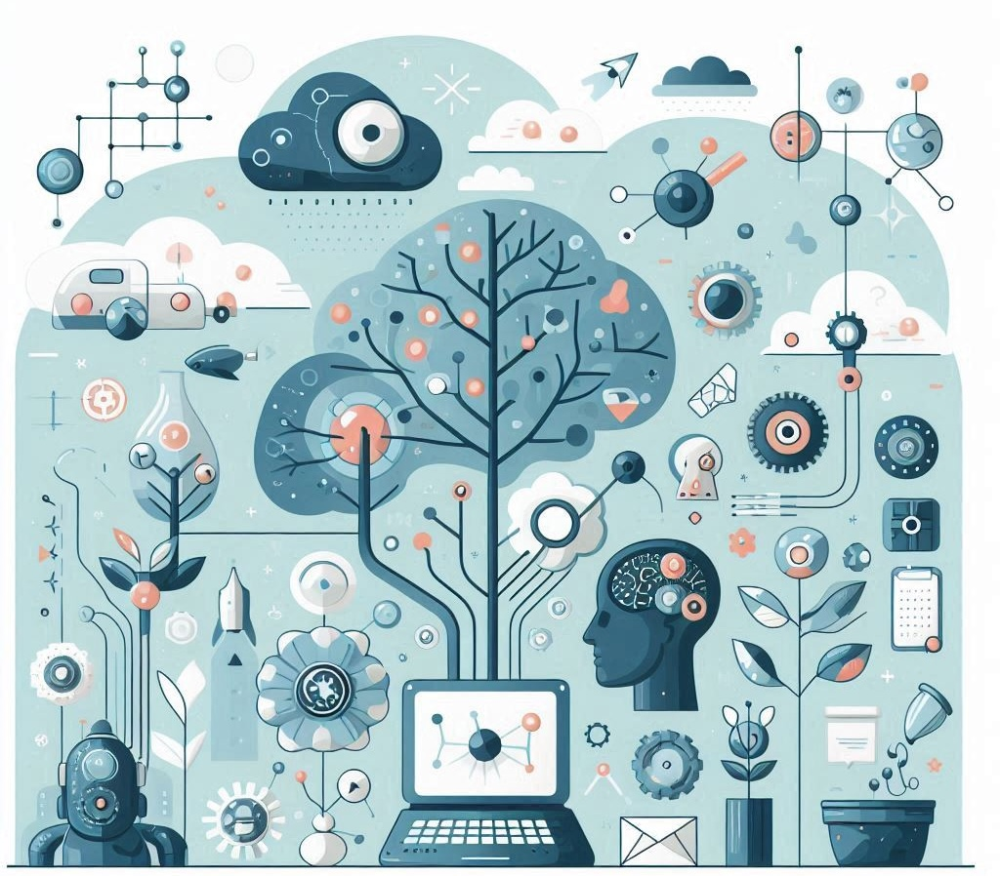

# Learning in Biological Systems: Decisions and Free Will

When we think about **learning**, we often think about school, books, and teachers. But learning happens in many ways, especially in **biological systems**, like our brains and the brains of animals. Let's explore how this works and how it relates to **making decisions and free will**, and how it connects to **artificial intelligence (AI)**, programming, and robotics.

## What is Learning in Biological Systems?

Learning in biological systems means how living things (like humans and animals) change their behavior based on experiences. For example, when a dog learns to sit because it gets a treat, that's learning. Our brains learn by forming connections between **neurons**, which are tiny cells that send messages. These connections help us **remember things** and improve our skills.

## How Do We Learn?

There are different ways we learn:

1. **Classical Conditioning:** This is when we learn to link two things together. For example, if you hear a bell every time you get a snack, soon you'll start to feel hungry just by hearing the bell. This is how Pavlov's dogs learned to salivate at the sound of a bell.

2. **Operant Conditioning:** This is when we learn from the consequences of our actions. If you do something good and get a reward, you'll want to do it again. If you do something bad and get punished, you'll avoid doing it again. This is how many animals and humans learn to behave.

3. **Observational Learning:** This is when we learn by watching others. If you see your friend solving a puzzle, you might learn how to solve it too just by observing. This type of learning is very important for social animals like humans.

## Decisions and Free Will

When we learn, we also make decisions. A decision is choosing between different options. For example, deciding what to eat for lunch or what game to play. Our decisions are influenced by our past experiences and what we've learned.

**Free Will** is the idea that we can choose our actions independently. But, are our decisions truly free? Let's explore this idea:

1. **Influences on Decisions:** Our decisions are often influenced by things we can't control. For example, our environment, our upbringing, and our experiences all shape our choices. If you've always had pizza on Fridays, you might choose pizza without really thinking about it.

2. **Brain and Choices:** Our brain makes decisions by weighing different options and predicting outcomes. Sometimes, our brain makes choices automatically based on what we've learned. Other times, we think carefully before deciding. This process involves different parts of the brain working together.

3. **True Freedom?:** Some scientists believe that our decisions are not completely free because they are based on previous experiences and biological processes. Others believe that we still have the power to make choices, even if they are influenced by other factors.
