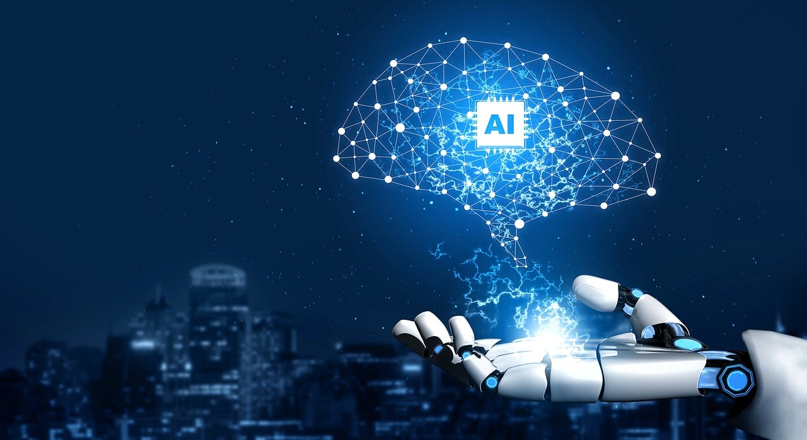
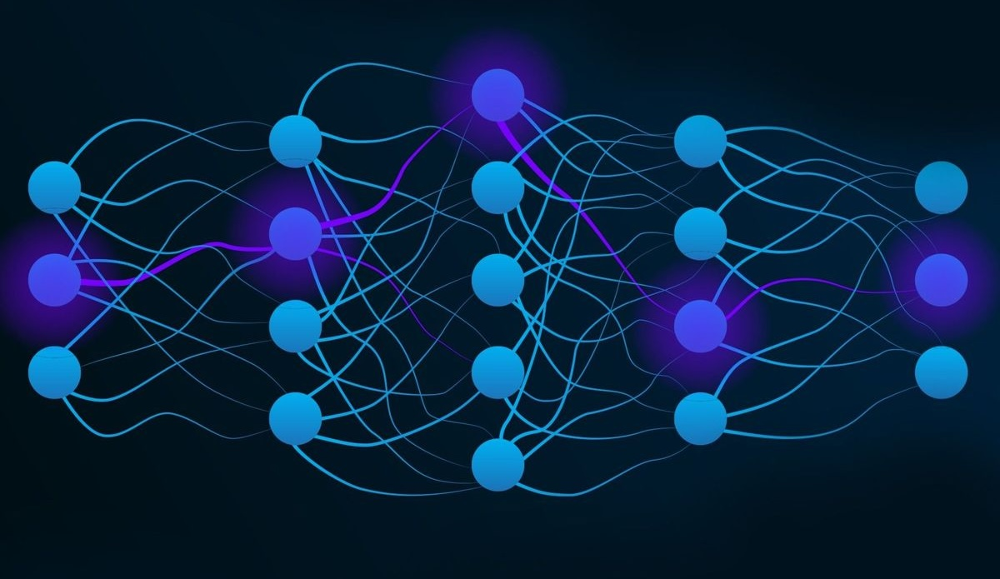
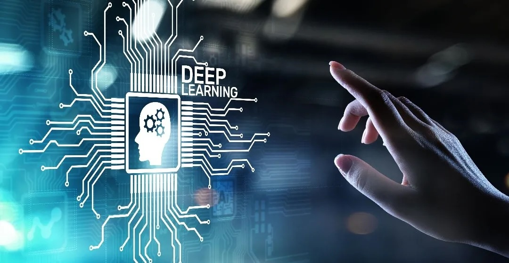

# Neural Networks and Deep Learning

## Introduction

Neural networks are computer programs inspired by the human brain. They use artificial neurons to recognize patterns and learn from data. For example, a network can distinguish between pictures of cats and non-cats after seeing many examples. Over time, it gets better at identifying patterns, like recognizing fruits or understanding speech on a phone.

Deep learning is a more advanced type of neural network with many layers, allowing computers to solve complex problems, like self-driving cars or translation apps. A famous example is AlphaGo, a program that learned to play the challenging board game Go, even defeating the world champion in 2016.

## Neural Networks

A **neural network** is a type of computer program that is inspired by the human brain. Just like our brain has neurons (tiny cells that send information), a neural network has **artificial neurons** that help it learn and make decisions. Imagine you are trying to recognize a picture of a cat. In a neural network, you give the computer many pictures of cats and non-cats. The network will then learn the difference between the two by looking at **patterns** in the images, such as shapes, colors, and edges.

Let's say you want the computer to recognize different fruits. You would show it many images of apples, bananas, and oranges. At first, the computer might make mistakes, like calling an apple a banana. But over time, it learns which patterns mean "apple" and which mean "banana." The more examples it sees, the better it gets. This is how a neural network **learns** from data.

A <b>neural network</b> is a computer program that uses artificial neurons to recognize patterns and make decisions based on learned data.

A real-life example is **voice recognition** on your phone. When you talk to your phone, the neural network tries to understand what you are saying by comparing your voice to many other examples it has learned before. It’s like training a pet: the more you train, the better it understands. Neural networks help computers get smarter by learning from examples, just like we do!

<iframe width="560" height="315" src="https://www.youtube.com/embed/bfmFfD2RIcg?si=txcKISRue6Q_EOde" title="YouTube video player" frameborder="0" allow="accelerometer; autoplay; clipboard-write; encrypted-media; gyroscope; picture-in-picture; web-share" referrerpolicy="strict-origin-when-cross-origin" allowfullscreen></iframe>

 

---

## Deep Learning

**Deep learning** is a special type of learning that uses **many layers** of neural networks to solve more complicated problems. Think of it like a big sandwich. Each layer in the network is like a piece of bread, cheese, or lettuce. When you put many layers together, you get a deep learning model, just like a big sandwich!

Each layer in deep learning looks at the information differently. The first layer might see basic shapes, like lines or circles. The next layer combines these shapes into more complex patterns, like faces or objects. By the time the information reaches the last layer, the computer can understand what the whole picture shows, like a dog, car, or even a specific person.

<b>Deep learning</b> is an advanced type of machine learning using multiple neural network layers to recognize complex patterns and solve difficult problems.

Deep learning is used in **self-driving cars**. These cars have cameras that take pictures of the road. The deep learning model analyzes the pictures to recognize **traffic signs, pedestrians, and other cars**. It uses all this information to decide whether to stop, turn, or keep driving.

Another example is **translation apps** that can change speech from one language to another. Deep learning helps these apps understand the words you speak, translate them, and say them back in a different language. With deep learning, computers can understand things that were too complex before!

---

## Neural Networks and Deep Learning: Crash Course AI

<iframe width="560" height="315" src="https://www.youtube.com/embed/oV3ZY6tJiA0?si=cWkIuFEr0wR-Axgj" title="YouTube video player" frameborder="0" allow="accelerometer; autoplay; clipboard-write; encrypted-media; gyroscope; picture-in-picture; web-share" referrerpolicy="strict-origin-when-cross-origin" allowfullscreen></iframe>

 

In this video, the speaker explains how to build an artificial neural network using the artificial neuron from a previous lesson. The focus is on why neural networks excel at complex tasks, like image recognition, due to their use of hidden layers. The video covers the mathematical principles behind these networks and highlights how multiple hidden layers enable deep learning. The speaker emphasizes the power of neural networks in detecting patterns in data, which has made them a dominant technology in modern machine learning.

---

## Neural Networks, Deep Learning, and AlphaGo

One of the most famous examples of **neural networks** and **deep learning** is the computer program called **AlphaGo** created by the company **DeepMind**. AlphaGo was designed to play the ancient board game called **Go**. Go is much more complex than chess because it has many more possible moves. In fact, there are more possible positions in Go than atoms in the universe!

<b>AlphaGo</b>, a DeepMind AI, mastered the complex game of Go using <b>neural networks</b>, even defeating the world champion in 2016.

AlphaGo used neural networks to learn how to play the game by studying many matches played by humans. It also played **millions of games against itself** to get better. Deep learning helped it understand the board and decide the best moves. The amazing thing is that AlphaGo became so good that it defeated the world champion of Go in 2016.

This was a big step forward for artificial intelligence because it showed that computers could learn to do very complex tasks that even humans find challenging. Today, similar techniques are used in other areas, like medical research, where AI helps doctors find signs of diseases in X-ray images. Thanks to neural networks and deep learning, computers can now solve problems that were once thought impossible!

---
