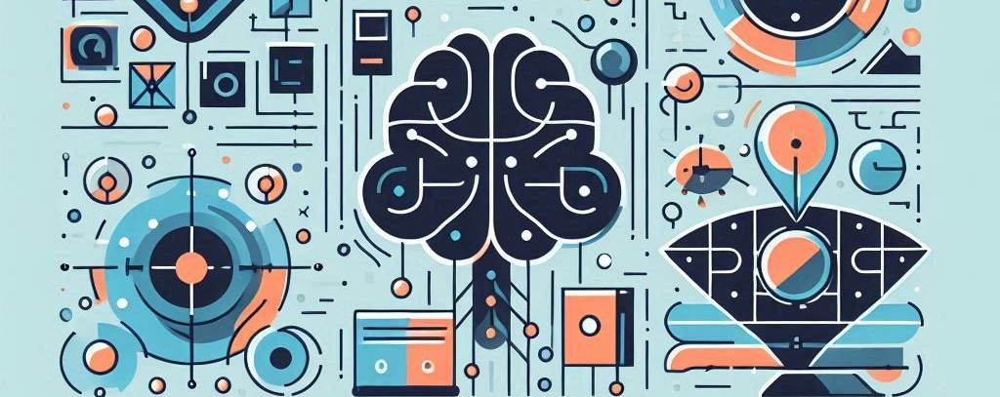

# Unit 1. Introduction to Programming, Artificial Intelligence and Robotics

In this unit, we will explore the fundamentals of programming, artificial intelligence (AI), and robotics. We will cover the basic concepts, terminologies, and applications of these fields, providing a solid foundation for further study.
