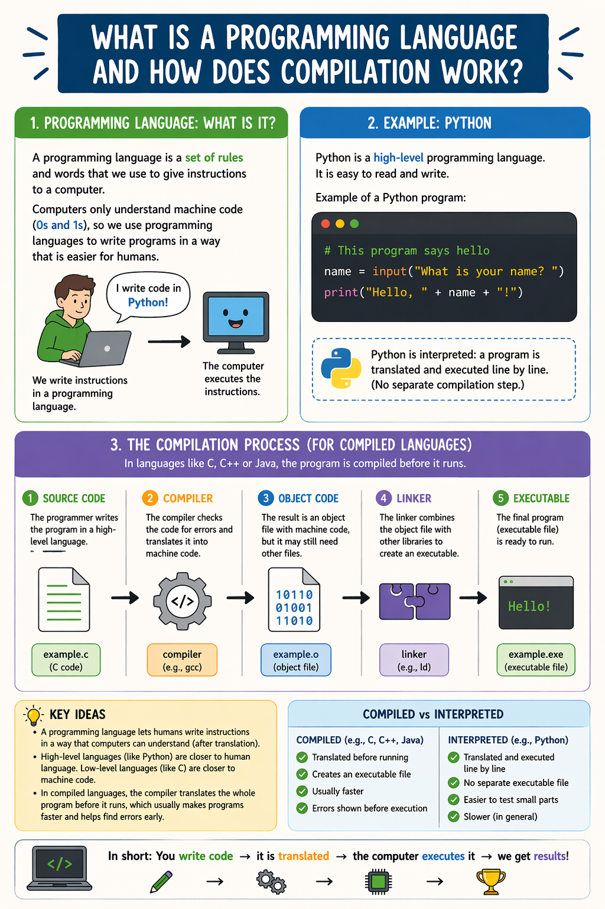

# Compilation vs Interpretation

In programming, there are two main approaches to executing code: **compilation** and **interpretation**. Both methods have their own advantages and disadvantages, and they are used in different programming languages and environments.

## Compilation

Compilation is the process of translating source code written in a high-level programming language into machine code that can be executed directly by the computer's hardware. This process is typically done by a compiler, which takes the entire source code and produces an executable file.

### Advantages of Compilation:
- **Performance**: Compiled code generally runs faster than interpreted code because it is optimized for the target machine.
- **Error Detection**: Compilers can catch syntax errors and other issues during the compilation process, which can help developers identify and fix problems before execution.
- **Distribution**: Compiled programs can be distributed as standalone executables, which can be run on any compatible system without requiring the source code.

### Disadvantages of Compilation:
- **Development Time**: The compilation process can take time, especially for large codebases, which can slow down the development cycle.
- **Platform Dependency**: Compiled code is often specific to a particular platform or architecture, which can limit its portability.

## Interpretation

Interpretation is the process of executing source code directly, without first translating it into machine code. An interpreter reads the source code line by line and executes it on the fly.

### Advantages of Interpretation:
- **Flexibility**: Interpreted languages often allow for dynamic typing and other features that can make development faster and more flexible.
- **Portability**: Since the source code is executed directly, interpreted languages can be run on any platform that has the appropriate interpreter, making them more portable.
- **Immediate Feedback**: Interpreters can provide immediate feedback on code execution, which can be beneficial for learning and debugging.

## Infographic: Compilation vs Interpretation

