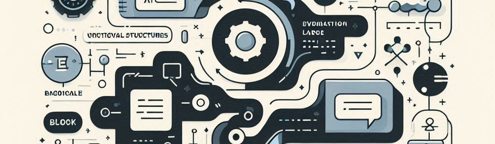

# Unit 2. Programming, Fundamentals: Data, Logic, and Control

In this unit, we will delve into the core principles of programming, focusing on data structures, logical operations, and control flow. We will learn how to manipulate data, implement logical conditions, and control the execution of programs to create efficient and effective software solutions.
