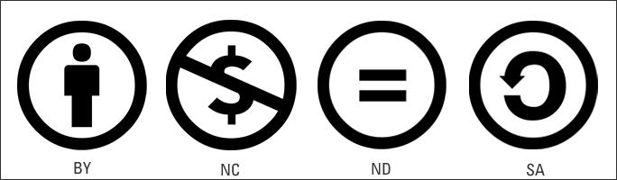

# Creative Commons Licenses

## What is Creative Commons?
Creative Commons (CC) is a system that allows creators to share their work with others while keeping some rights. It provides different types of licenses to control how a work can be used, modified, and shared.

## Types of Creative Commons Licenses
There are six main types of Creative Commons licenses. Each has different rules about how the work can be used.

### 1. **CC BY (Attribution)**
- This is the most open license.
- You can copy, change, and share the work, even for commercial purposes.
- You must give credit to the original creator.

### 2. **CC BY-SA (Attribution-ShareAlike)**
- You can copy, change, and share the work, even for commercial purposes.
- You must give credit to the original creator.
- If you make changes, you must use the same CC BY-SA license for your work.

### 3. **CC BY-ND (Attribution-NoDerivatives)**
- You can copy and share the work, even for commercial purposes.
- You must give credit to the original creator.
- You cannot change or modify the work in any way.

### 4. **CC BY-NC (Attribution-NonCommercial)**
- You can copy, change, and share the work for non-commercial purposes.
- You must give credit to the original creator.
- You cannot use the work for commercial purposes.

### 5. **CC BY-NC-SA (Attribution-NonCommercial-ShareAlike)**
- You can copy, change, and share the work for non-commercial purposes.
- You must give credit to the original creator.
- If you make changes, you must use the same CC BY-NC-SA license for your work.
- You cannot use the work for commercial purposes.

### 6. **CC BY-NC-ND (Attribution-NonCommercial-NoDerivatives)**
- This is the most restrictive license.
- You can copy and share the work for non-commercial purposes.
- You must give credit to the original creator.
- You cannot change or modify the work in any way.
- You cannot use the work for commercial purposes.

## How to Recognize Creative Commons Licenses
Each CC license has a symbol:
- **BY** = Credit must be given.
- **SA** = Share with the same license.
- **ND** = No changes allowed.
- **NC** = No commercial use.

## Why Use Creative Commons?
- It helps creators share their work while keeping some rights.
- It makes it easy for people to use and share creative works legally.
- It encourages collaboration and creativity.

## Summary Table
| License | Can share? | Can modify? | Can use commercially? | Must give credit? |
|---------|-----------|-------------|-----------------------|------------------|
| CC BY | Yes | Yes | Yes | Yes |
| CC BY-SA | Yes | Yes | Yes | Yes |
| CC BY-ND | Yes | No | Yes | Yes |
| CC BY-NC | Yes | Yes | No | Yes |
| CC BY-NC-SA | Yes | Yes | No | Yes |
| CC BY-NC-ND | Yes | No | No | Yes |

With Creative Commons, we can share knowledge, art, and ideas in a legal and respectful way.

