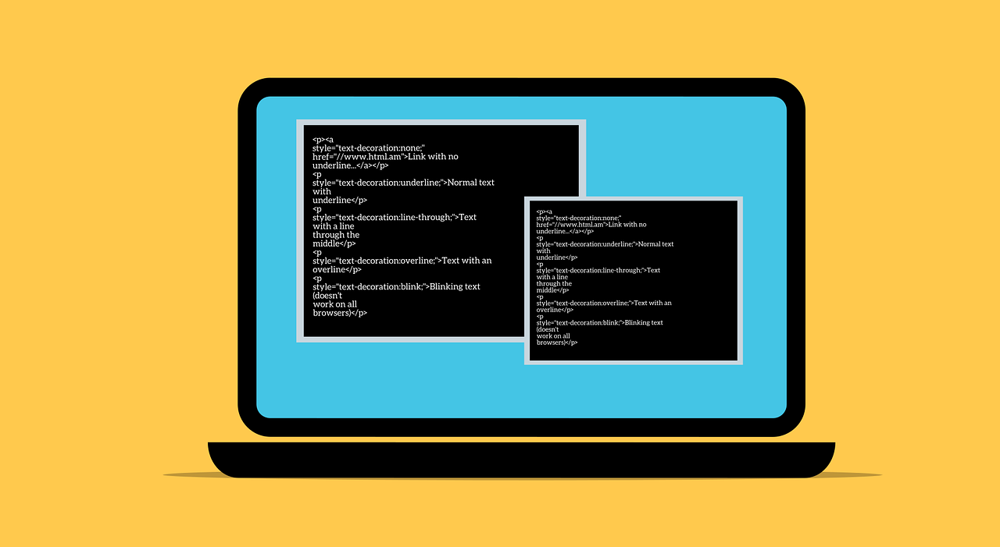

# Free Software Licenses

## What is a Software License?
A software license is a legal document that defines how a piece of software can be used, shared, and modified. When you install or download software, you agree to its license terms.

Some licenses are very restrictive and do not allow users to modify or share the software. Others, known as **free software licenses**, allow users to freely use, modify, and distribute the software.

---

## What is Free Software?
**Free software** does not mean free of cost. Instead, it refers to **freedom**. Free software allows users to:

1. **Run** the program for any purpose.
2. **Study** and change how the program works.
3. **Distribute** copies of the program.
4. **Improve** the program and share the improvements.

These four freedoms ensure that software remains open and accessible to all users.

---

## Types of Free Software Licenses
There are different types of free software licenses. Some are more permissive, while others require that modifications also remain free.

### 1. **GNU General Public License (GPL)**
- One of the most common free software licenses.
- Any modified version of a GPL-licensed program must also be distributed under the GPL.
- Ensures that software remains free for all users.

### 2. **MIT License**
- A very permissive license.
- Allows users to modify, share, and use the software in any way, even in proprietary software.
- Only requires that the original license and copyright notice remain.

### 3. **Apache License**
- Similar to the MIT License but includes a patent clause.
- Protects users from patent-related issues.
- Allows both free and proprietary use of the software.

### 4. **Creative Commons (CC) Licenses**
- Often used for creative works, but some versions apply to software.
- Different types of CC licenses exist, some allowing modifications and others restricting them.

---

## Why Use Free Software Licenses?
Free software licenses are important because they:
- Promote **collaboration** and innovation.
- Allow people to **learn** from existing programs.
- Ensure software remains **accessible** to everyone.
- Protect users from **unfair restrictions**.

Many popular programs, like Linux, Firefox, and Blender, use free software licenses.

---

## Summary
- A **software license** defines how a program can be used, shared, and modified.
- **Free software** gives users the right to run, modify, distribute, and improve software.
- Common **free software licenses** include GPL, MIT, Apache, and Creative Commons.
- These licenses support **innovation, learning, and accessibility**.

Understanding free software licenses helps users make informed decisions about the programs they use and create!