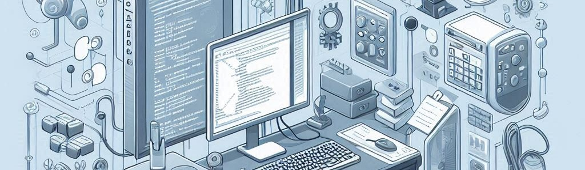

# Unit 5. Software Management: Programming Languages, Licenses and Maintenance

## Summary

This unit introduces students to the basics of programming, focusing on high-level languages, software evaluation and maintenance, and software licenses.

**Programming in High-Level Languages**  
Programming involves giving instructions to computers using high-level languages like Python, Java, and C++. These languages are more accessible than low-level ones, using readable code similar to English. Python is known for its simplicity, Java for building complex applications, and C++ for game development. Programming languages can be classified into procedural, object-oriented, and functional, each focusing on different ways to structure code. A programmer must understand both the **syntax** (rules of writing code) and **semantics** (meaning behind the code) to write correct and effective programs.

**Software Evaluation and Maintenance**  
After software is created, it must be evaluated for functionality, security, and user experience through various testing methods like unit, integration, system, and user testing. Maintenance ensures the software remains functional, with tasks such as correcting bugs, adapting to new environments, and enhancing features. Regular evaluation and maintenance are crucial to keeping software up-to-date and free from errors.

**Software Licenses**  
Software licenses govern how software can be used, modified, and distributed. Free software, like Linux, can be freely modified and shared, while proprietary software, like Microsoft Windows, restricts access to its source code. Respecting licenses ensures legal use and protects creators’ rights.

By understanding these concepts, students will learn how to evaluate, maintain, and create software responsibly.

## Evaluation Criteria

1. **Evaluating and Maintaining Developed Software**: You should be able to test and maintain software you create. This includes running different tests to check for bugs, fixing any issues, and making sure the software is efficient and secure.

2. **Applying and Respecting Copyright and Licenses**: When creating software, it is important to follow proper licensing rules. You should always give credit to authors of free software and ensure that your software follows the license you’ve chosen, whether free or proprietary.

These criteria help you build better software while respecting the work of others and ensuring your software is legal, secure, and efficient.