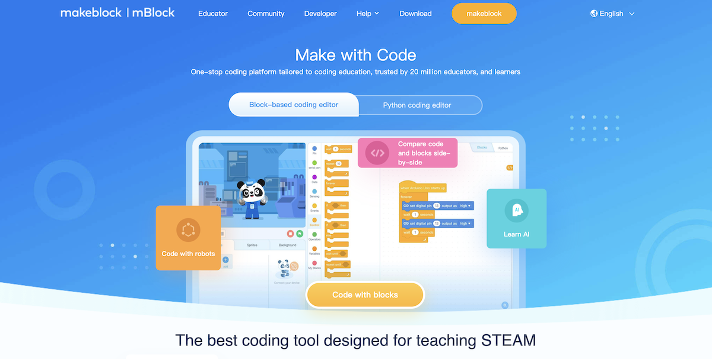

# mBlock

## What Is mBlock 5?

mBlock 5 is designed for the Science, Technology, Engineering, Arts and Mathematics (STEAM) education. Inspired by Scratch 3.0, it supports both graphical and textual programming languages.

Currently, more than 10 million people are using it to learn programming, create their own projects, and share their creations. With mBlock 5, you can design engaging stories, games, and animations, and program devices such as Makeblock robots and microbit.

On mBlock 5, you can switch to the Python mode simply with one-click. In addition, mBlock 5 integrates cutting-edge technologies including Artificial Intelligence (AI) and Internet of Things (IoT).

## Software versions

Currently, the following versions are available:

- For **PCs** (software required): [www.mblock.cc/en-us/download](https://www.mblock.cc/en-us/download)
- **Web version** (no software required): [ide.mblock.cc/](https://ide.mblock.cc/)
- For **Android** and **iOS**: Search for mBlock on any app store to download it

